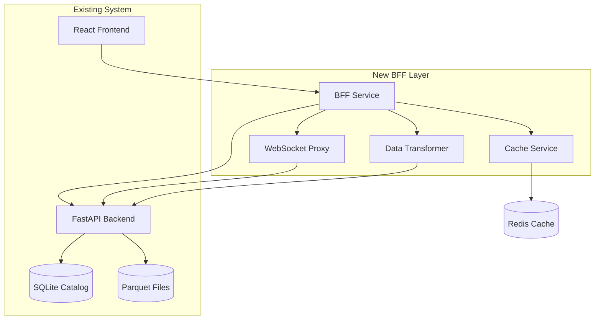

# Hewston Trading Platform Brownfield Enhancement Architecture

**Status**: v1.0 — BFF Implementation Architecture  
**Date**: 2025-01-27  
**Author**: Winston (Architect)

## Introduction

This document outlines the architectural approach for enhancing Hewston Trading Platform with Backend-for-Frontend (BFF) pattern implementation. Its primary goal is to serve as the guiding architectural blueprint for AI-driven development of new features while ensuring seamless integration with the existing system.

**Relationship to Existing Architecture:**
This document supplements existing project architecture by defining how new BFF components will integrate with current FastAPI backend and React frontend systems. Where conflicts arise between new and existing patterns, this document provides guidance on maintaining consistency while implementing enhancements.

### Existing Project Analysis

#### Current Project State
- **Primary Purpose:** Real-time backtesting platform for trading strategies with live-like playback and performance analysis
- **Current Tech Stack:** FastAPI (Python) + React (TypeScript) + Vite + TailwindCSS + SQLite + Parquet + WebSocket streaming
- **Architecture Style:** Hexagonal architecture with ports/adapters pattern, presentational-only frontend components
- **Deployment Method:** Monorepo structure with local development setup, containerization-ready

#### Available Documentation
- **Main Architecture** (`docs/architecture.md`) - Comprehensive system design with hexagonal patterns
- **API Reference** (`docs/api-reference.md`) - Complete API documentation including WebSocket protocol
- **UI/UX Specification** (`docs/ui-ux-specification.md`) - Frontend component architecture and user flows
- **PRD Documentation** - Sharded PRD with 7 epics covering complete trading platform features
- **QA Reference** (`docs/qa-reference.md`) - Testing framework and acceptance criteria

#### Identified Constraints
- **Technology Consistency** - Strong preference for Python ecosystem alignment with existing FastAPI backend
- **Performance Requirements** - Must maintain ~30 FPS WebSocket streaming for real-time trading data
- **Data Volume** - Handling large market datasets (1+ year of minute-level OHLC data)
- **Existing API Contracts** - Must preserve compatibility with current frontend API consumption patterns
- **Monorepo Structure** - New BFF must integrate cleanly with existing backend/frontend organization

## Enhancement Scope and Integration Strategy

### Enhancement Overview
- **Enhancement Type:** Backend-for-Frontend (BFF) Layer Implementation
- **Scope:** Comprehensive frontend-backend communication refactoring with data aggregation, WebSocket proxy, and API optimization
- **Integration Impact:** Medium-High - New service layer between existing frontend and backend, no changes to core backend logic

### Integration Approach
- **Code Integration Strategy:** New BFF service in monorepo (`bff/` directory) with FastAPI framework for consistency, preserving existing backend and frontend codebases
- **Database Integration:** Read-only access to existing SQLite catalog, no schema changes required, BFF acts as intelligent query layer
- **API Integration:** BFF proxies and aggregates existing FastAPI endpoints, frontend gradually migrates from direct backend calls to BFF endpoints
- **UI Integration:** Minimal frontend changes - update API client base URLs and simplify data transformation logic in components

### Compatibility Requirements
- **Existing API Compatibility:** Full backward compatibility maintained - existing endpoints remain functional during migration
- **Database Schema Compatibility:** No database changes required - BFF reads existing catalog and artifact data
- **UI/UX Consistency:** Preserve all existing user flows and component behavior, enhance performance without changing interfaces
- **Performance Impact:** Target <100ms additional latency for API calls, maintain ~30 FPS WebSocket streaming performance

## Tech Stack

### Existing Technology Stack
| Category | Current Technology | Version | Usage in Enhancement | Notes |
|----------|-------------------|---------|---------------------|-------|
| Backend Framework | FastAPI | Latest | BFF service framework | Maintain consistency with existing backend |
| Language | Python | 3.11+ | BFF implementation language | Leverage existing team expertise |
| HTTP Client | httpx | Latest | Backend communication | Async-compatible with FastAPI |
| WebSocket | FastAPI WebSocket | Latest | WebSocket proxy | Native FastAPI WebSocket support |
| Validation | Pydantic | v2 | Request/response validation | Share models with existing backend |
| Database | SQLite | Latest | Read-only catalog access | No changes to existing database |
| Logging | structlog | Latest | Structured logging | Consistent with existing backend patterns |
| Testing | pytest | Latest | BFF testing framework | Maintain existing test patterns |

### New Technology Additions
| Technology | Version | Purpose | Rationale | Integration Method |
|------------|---------|---------|-----------|-------------------|
| Redis | 7.x | Response caching | Performance optimization for chart data | Optional dependency, graceful degradation |
| uvicorn | Latest | ASGI server for BFF | Production deployment | Consistent with existing backend deployment |

## Data Models and Schema Changes

### New Data Models

#### ChartDataRequest
**Purpose:** Unified request model for chart data aggregation across multiple timeframes  
**Integration:** Replaces multiple frontend calls to `/bars/daily`, `/bars/minute`, `/bars/hour`

**Key Attributes:**
- symbol: str - Trading symbol (e.g., "AAPL")
- timeframe: str - Unified timeframe specification ("1D", "1H", "1M", "1M_DECIMATED")
- from_date: date - Start date for data range
- to_date: date - End date for data range
- target_points: Optional[int] - For data decimation (default: 10000)

#### RunCompleteResponse
**Purpose:** Aggregated run data combining multiple backend endpoints  
**Integration:** Replaces multiple frontend API calls for run details

**Key Attributes:**
- run: RunDetail - Basic run information
- metrics: RunMetrics - Performance metrics
- equity: List[EquityPoint] - Equity curve data
- orders: List[OrderData] - Trading orders (optional)
- metadata: ResponseMetadata - Load time and caching info

### Schema Integration Strategy
**Database Changes Required:**
- **New Tables:** None - BFF operates read-only on existing catalog
- **Modified Tables:** None - existing schema preserved
- **Migration Strategy:** No database migration needed - BFF layer only

**Backward Compatibility:**
- Existing API endpoints remain functional during BFF migration
- Frontend can gradually migrate from direct backend calls to BFF endpoints
- No breaking changes to existing data models or database schema

## Component Architecture

### New Components

#### BFFService
**Responsibility:** Main FastAPI application providing unified API layer between frontend and backend  
**Integration Points:** Frontend API client, Backend FastAPI service, Redis cache

**Key Interfaces:**
- `/api/v1/chart-data` - Unified chart data aggregation endpoint
- `/api/v1/runs/{id}/complete` - Complete run data aggregation endpoint
- `/api/v1/runs/{id}/stream` - WebSocket proxy for real-time playback

**Dependencies:**
- **Existing Components:** Backend FastAPI service, SQLite catalog, Parquet data files
- **New Components:** DataTransformer, WebSocketProxy, CacheService

#### DataTransformer
**Responsibility:** Transform and aggregate backend data into frontend-optimized formats  
**Key Interfaces:**
- `transform_chart_data()` - Convert backend bar data to unified format
- `aggregate_run_data()` - Combine multiple backend endpoints into single response
- `decimate_data()` - Reduce data points for performance optimization

#### WebSocketProxy
**Responsibility:** Proxy and enhance WebSocket connections between frontend and backend  
**Key Interfaces:**
- `connect_client()` - Handle frontend WebSocket connections
- `proxy_messages()` - Forward and transform messages between frontend/backend
- `manage_reconnection()` - Handle connection failures and automatic reconnection

#### CacheService
**Responsibility:** Intelligent caching of expensive data operations for performance optimization  
**Key Interfaces:**
- `cache_chart_data()` - Cache chart data with TTL-based invalidation
- `cache_run_data()` - Cache aggregated run information
- `invalidate_cache()` - Handle cache invalidation on data updates

### Component Interaction Diagram


## API Design and Integration

### API Integration Strategy
**API Integration Strategy:** RESTful endpoints with WebSocket streaming, maintaining existing FastAPI patterns and async capabilities  
**Authentication:** Pass-through authentication from frontend to backend - BFF acts as transparent proxy for auth tokens  
**Versioning:** `/api/v1/` prefix for BFF endpoints, allowing future API evolution without breaking existing integrations

### New API Endpoints

#### Chart Data Aggregation
- **Method:** GET
- **Endpoint:** `/api/v1/chart-data`
- **Purpose:** Unified chart data endpoint replacing multiple backend bar endpoints
- **Integration:** Aggregates `/bars/daily`, `/bars/minute`, `/bars/hour` based on timeframe parameter

#### Complete Run Data
- **Method:** GET
- **Endpoint:** `/api/v1/runs/{id}/complete`
- **Purpose:** Aggregated run data combining multiple backend endpoints into single response
- **Integration:** Combines `/backtests/{id}`, `/backtests/{id}/metrics`, `/backtests/{id}/equity`

#### WebSocket Streaming Proxy
- **Method:** WebSocket
- **Endpoint:** `/api/v1/runs/{id}/stream`
- **Purpose:** Enhanced WebSocket proxy with connection management and message transformation
- **Integration:** Proxies existing `/backtests/{id}/ws` with added reliability features

## Source Tree

### New File Organization
```plaintext
hewston-app/version-03/
├── backend/                        # Existing backend (unchanged)
├── frontend/                       # Existing frontend (unchanged)
├── bff/                           # New BFF service
│   ├── app/
│   │   ├── main.py                # FastAPI application factory
│   │   ├── config.py              # Configuration management
│   │   └── dependencies.py        # Dependency injection
│   ├── api/
│   │   ├── v1/
│   │   │   ├── chart.py           # Chart data endpoints
│   │   │   ├── runs.py            # Run data endpoints
│   │   │   └── websocket.py       # WebSocket proxy endpoints
│   │   └── middleware/
│   │       ├── error_handler.py   # Global error handling
│   │       ├── logging.py         # Request/response logging
│   │       └── cors.py            # CORS configuration
│   ├── services/
│   │   ├── backend_client.py      # Backend HTTP client
│   │   ├── cache.py               # Caching service
│   │   ├── transformer.py        # Data transformation logic
│   │   └── websocket_proxy.py    # WebSocket proxy service
│   ├── models/
│   │   ├── requests.py            # Request models
│   │   ├── responses.py           # Response models
│   │   └── shared.py              # Shared data models
│   ├── tests/
│   │   ├── unit/                  # Unit tests
│   │   ├── integration/           # Integration tests
│   │   └── fixtures/              # Test fixtures
│   └── requirements.txt           # BFF dependencies
└── docs/
    └── architecture/
        └── bff-architecture.md    # This document
```

### Integration Guidelines
- **File Naming:** Follow existing Python conventions with snake_case for modules and PascalCase for classes
- **Folder Organization:** Mirror existing backend structure with app/, api/, services/, models/ pattern for consistency
- **Import/Export Patterns:** Use absolute imports from bff package root, maintain existing FastAPI dependency injection patterns

## Infrastructure and Deployment Integration

### Enhancement Deployment Strategy
**Deployment Approach:** Extend existing Docker-based deployment with new BFF service container, maintain monorepo structure  
**Infrastructure Changes:** Add BFF service to docker-compose.yml, optional Redis container for caching, load balancer configuration for service routing  
**Pipeline Integration:** Extend existing build processes to include BFF service, maintain unified deployment commands through make system

### Rollback Strategy
**Rollback Method:** Feature flags in frontend to switch between direct backend calls and BFF endpoints, allowing instant rollback without service restart  
**Risk Mitigation:** Gradual migration approach with endpoint-by-endpoint rollout, comprehensive monitoring of BFF performance vs direct backend calls  
**Monitoring:** Extend existing logging patterns to include BFF request/response times, error rates, and cache hit ratios

## Testing Strategy

### Integration with Existing Tests
**Existing Test Framework:** pytest with async support, FastAPI TestClient for API testing, fixture-based test data management  
**Test Organization:** Unit tests in tests/unit/, integration tests in tests/integration/, shared fixtures in tests/fixtures/  
**Coverage Requirements:** Maintain existing coverage standards, focus on critical path testing for BFF proxy and transformation logic

### New Testing Requirements
- **Unit Tests:** 90%+ coverage for data transformation logic, 80%+ for service components
- **Integration Tests:** BFF-to-backend communication, end-to-end API flows, WebSocket proxy functionality
- **Regression Testing:** Automated tests to ensure frontend can still access all existing functionality through BFF

## Security Integration

### Existing Security Measures
**Authentication:** Pass-through token-based authentication from frontend to backend, no authentication logic in BFF layer  
**Authorization:** Existing backend authorization patterns preserved, BFF acts as transparent proxy for auth decisions  
**Data Protection:** Maintain existing data handling patterns, no additional data storage in BFF layer, read-only database access

### Enhancement Security Requirements
**New Security Measures:** Input validation at BFF layer using Pydantic models, rate limiting for BFF endpoints, secure WebSocket proxy configuration  
**Integration Points:** BFF validates all requests before forwarding to backend, preserves existing auth tokens in proxy calls, maintains audit trail for all BFF operations

## Next Steps

### Story Manager Handoff
Create implementation stories for the BFF enhancement based on this architecture document. Key requirements:
- BFF must maintain full compatibility with existing FastAPI backend (no backend modifications)
- Frontend migration should be gradual with feature flags for rollback capability
- All existing API contracts must remain functional during transition
- First story: Create BFF service skeleton with health endpoint and basic FastAPI setup

### Developer Handoff
Begin BFF implementation following this architecture specification and existing coding standards:
- Follow existing FastAPI patterns from backend/ directory structure
- Use established Pydantic validation and async/await patterns
- Maintain existing logging format with structlog and correlation IDs
- Technology Stack: FastAPI + Python 3.11+ for consistency with existing backend

---

**Architecture Validation:** ✅ **APPROVED FOR IMPLEMENTATION**  
**Readiness Assessment:** HIGH - Ready for development with comprehensive specifications  
**Risk Level:** LOW - Well-designed brownfield enhancement preserving system integrity
