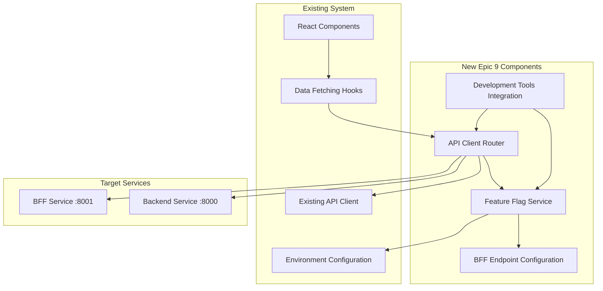

# Hewston Trading Platform Epic 9 Frontend BFF Integration Architecture

**Status**: v1.0 — Frontend BFF Integration Architecture  
**Date**: 2025-01-27  
**Author**: Winston (Architect)

## Introduction

This document outlines the architectural approach for enhancing Hewston Trading Platform with **Frontend BFF Integration**. Its primary goal is to serve as the guiding architectural blueprint for AI-driven development of Epic 9 while ensuring seamless integration with the existing React frontend and BFF service.

**Relationship to Existing Architecture:**
This document supplements the existing BFF architecture (`docs/architecture/bff-architecture.md`) by defining how the React frontend will integrate with the BFF layer. Where conflicts arise between new integration patterns and existing frontend patterns, this document provides guidance on maintaining consistency while implementing the migration.

### Existing Project Analysis

#### Current Project State
- **Primary Purpose:** Real-time backtesting platform for trading strategies with live-like playback and performance analysis
- **Current Tech Stack:** React + TypeScript + Vite (frontend), FastAPI + Python 3.11 (backend), BFF service (Epic 8 complete), SQLite catalog, Parquet data files, WebSocket streaming
- **Architecture Style:** Hexagonal architecture with ports/adapters pattern, direct frontend-to-backend communication via Vite proxy
- **Deployment Method:** Monorepo structure with Docker containerization, local development setup

#### Available Documentation
- **Main Architecture** (`docs/architecture.md`) - Comprehensive system design with hexagonal patterns
- **BFF Architecture** (`docs/architecture/bff-architecture.md`) - Complete BFF implementation from Epic 8
- **API Reference** (`docs/api-reference.md`) - Complete API documentation including WebSocket protocol
- **Epic 9 PRD** (`docs/prd/epic-9-frontend-bff-integration.md`) - Detailed integration requirements
- **Stories Portfolio** (`docs/stories/9.1-9.3.story.md`) - Comprehensive story breakdown

#### Identified Constraints
- **Frontend API Pattern:** Direct backend calls via Vite proxy (`/backtests`, `/bars`, `/healthz`)
- **Component Interface Preservation:** React component interfaces must remain unchanged
- **Performance Requirements:** Must maintain ~30 FPS WebSocket streaming, improve chart loading
- **Technology Consistency:** Must use existing React + TypeScript + Vite patterns
- **Rollback Capability:** Feature flags must enable instant reversion to direct backend
- **Development Workflow:** Cannot disrupt existing development processes

## Enhancement Scope and Integration Strategy

### Enhancement Overview
- **Enhancement Type:** Frontend API Client Migration with Feature Flag Architecture
- **Scope:** Migrate React frontend from direct backend API calls to BFF endpoints with gradual rollout capability
- **Integration Impact:** Medium - New feature flag layer and API routing changes, no modifications to React components or BFF service

### Integration Approach
- **Code Integration Strategy:** Extend existing API client (`frontend/src/services/api.ts`) with conditional endpoint selection based on feature flags, maintain all existing component interfaces
- **Database Integration:** No database changes required - BFF handles all backend data access from Epic 8
- **API Integration:** Frontend routes API calls to BFF (`http://127.0.0.1:8001/api/v1/*`) instead of direct backend (`http://127.0.0.1:8000/*`) when feature flags enabled
- **UI Integration:** Zero UI changes - maintain existing React component interfaces, data flows, and user experience

### Compatibility Requirements
- **Existing API Compatibility:** Full backward compatibility - direct backend calls remain functional during migration, feature flags control routing
- **Database Schema Compatibility:** No schema changes - BFF provides read-only access to existing SQLite catalog and Parquet data
- **UI/UX Consistency:** Preserve all existing user flows, component behavior, and visual interfaces - users see no functional changes
- **Performance Impact:** Target improved performance through BFF caching and aggregation, <50ms additional latency for WebSocket proxy

## Tech Stack

### Existing Technology Stack

| Category | Current Technology | Version | Usage in Enhancement | Notes |
|----------|-------------------|---------|---------------------|-------|
| Frontend Framework | React | 18+ | Component interfaces preserved | No changes to React patterns |
| Language | TypeScript | Latest | Type safety for feature flags | Extend existing type definitions |
| Build Tool | Vite | Latest | Proxy configuration updates | Add BFF routing alongside backend |
| HTTP Client | Fetch API | Native | API client conditional routing | Extend existing `frontend/src/utils/api.ts` |
| Validation | Zod | Latest | Response validation maintained | No changes to existing schemas |
| State Management | TanStack Query | Latest | Data fetching hooks preserved | No changes to query patterns |
| Development Server | Vite Dev Server | Latest | Proxy both BFF and backend | Simultaneous routing during migration |
| Environment Config | Vite Env Variables | Latest | Feature flag configuration | Add BFF-specific environment variables |

### New Technology Additions

No new technologies required for Epic 9 implementation. The enhancement leverages existing frontend technology stack with configuration extensions.

## Data Models and Schema Changes

### New Data Models

#### FeatureFlagConfiguration
**Purpose:** Runtime configuration for BFF endpoint selection and migration control  
**Integration:** Client-side configuration object that controls API routing decisions

**Key Attributes:**
- `bffEnabled: boolean` - Master toggle for BFF usage (default: false)
- `chartDataEnabled: boolean` - Enable BFF chart data aggregation endpoint
- `runDataEnabled: boolean` - Enable BFF run data aggregation endpoint  
- `websocketEnabled: boolean` - Enable BFF WebSocket proxy
- `fallbackToBackend: boolean` - Graceful fallback when BFF unavailable

#### BFFEndpointConfiguration
**Purpose:** Dynamic endpoint URL configuration based on feature flag state  
**Integration:** Extends existing `frontend/src/constants.ts` API configuration patterns

**Key Attributes:**
- `apiBaseUrl: string` - Dynamic base URL (backend or BFF based on flags)
- `wsBaseUrl: string` - Dynamic WebSocket URL (backend or BFF based on flags)
- `endpointMappings: Record<string, string>` - Mapping of logical endpoints to actual URLs
- `timeoutConfig: object` - Timeout configuration for different endpoint types

### Schema Integration Strategy
**Database Changes Required:**
- **New Tables:** None - Epic 9 is frontend-only integration
- **Modified Tables:** None - no backend or database modifications
- **Migration Strategy:** No database migration needed - configuration-only changes

**Backward Compatibility:**
- All existing API response formats preserved through BFF proxy and direct backend calls
- Feature flags default to `false` ensuring existing behavior is preserved
- Environment variable configuration enables instant rollback to direct backend

## Component Architecture

### New Components

#### FeatureFlagService
**Responsibility:** Centralized feature flag evaluation and configuration management for BFF endpoint selection  
**Key Interfaces:**
- `evaluateFeatureFlag(flagName: string): boolean` - Runtime flag evaluation
- `getEndpointConfiguration(): BFFEndpointConfiguration` - Dynamic endpoint selection
- `isFeatureFlagEnabled(feature: 'chartData' | 'runData' | 'websocket'): boolean` - Granular flag checks

#### APIClientRouter
**Responsibility:** Route API calls to BFF or backend based on feature flag configuration  
**Key Interfaces:**
- `routeAPICall(endpoint: string, options: RequestOptions): Promise<Response>` - Conditional routing
- `getEffectiveBaseURL(endpointType: string): string` - Dynamic URL resolution
- `handleFallback(error: Error, originalRequest: RequestOptions): Promise<Response>` - Graceful degradation

#### DevelopmentToolsIntegration
**Responsibility:** Provide visibility into feature flag state and endpoint routing for debugging  
**Key Interfaces:**
- `exposeFeatureFlagState(): void` - Make flags visible in browser console
- `logEndpointRouting(endpoint: string, target: 'bff' | 'backend'): void` - Route logging
- `validateConfiguration(): ConfigurationStatus` - Configuration health checks

### Component Interaction Diagram


## Source Tree

### New File Organization
```plaintext
hewston-app/version-03/
├── frontend/
│   ├── src/
│   │   ├── services/
│   │   │   ├── api.ts                    # Existing API client (extended)
│   │   │   └── featureFlags.ts           # New: Feature flag service
│   │   ├── utils/
│   │   │   ├── api.ts                    # Existing utilities (extended)
│   │   │   ├── apiRouter.ts              # New: API routing logic
│   │   │   └── developmentTools.ts       # New: Dev tools integration
│   │   ├── types/
│   │   │   ├── api.ts                    # Existing types (unchanged)
│   │   │   └── featureFlags.ts           # New: Feature flag types
│   │   ├── constants.ts                  # Extended with BFF configuration
│   │   └── config/
│   │       └── featureFlags.ts           # New: Feature flag configuration
│   ├── vite.config.ts                    # Extended with BFF proxy routes
│   ├── .env.example                      # Extended with BFF feature flags
│   └── .env.local                        # Extended with BFF feature flags
└── docs/
    └── architecture/
        └── epic-9-frontend-bff-integration-architecture.md  # This document
```

### Integration Guidelines
- **File Naming:** Follow existing TypeScript conventions with camelCase for files, PascalCase for types and classes
- **Folder Organization:** Maintain existing `services/`, `utils/`, `types/` structure with logical grouping of feature flag functionality
- **Import/Export Patterns:** Use absolute imports from `src/` root, maintain existing barrel export patterns, extend existing service interfaces

## Infrastructure and Deployment Integration

### Enhancement Deployment Strategy
**Deployment Approach:** Frontend-only changes with environment-based feature flag configuration, no infrastructure modifications required  
**Infrastructure Changes:** None - leverages existing Vite development server and build processes, extends existing environment variable patterns  
**Pipeline Integration:** Extends existing frontend build process with additional environment variables, maintains current deployment workflow

### Rollback Strategy
**Rollback Method:** Environment variable changes enable instant rollback to direct backend calls without code deployment or service restart  
**Risk Mitigation:** Feature flags default to `false` (direct backend), gradual endpoint-by-endpoint migration with independent rollback capability  
**Monitoring:** Extend existing logging patterns with feature flag state and endpoint routing visibility, performance metrics for BFF vs backend comparison

## Next Steps

### Developer Handoff
Begin Epic 9 implementation following this architecture specification:

- **Architecture Reference:** Follow this comprehensive integration architecture and existing frontend patterns
- **Integration Requirements:** Extend existing API client utilities, maintain React component interface compatibility, implement feature flag architecture as specified
- **Technical Decisions:** Environment-based feature flag configuration, API router pattern for endpoint selection, graceful fallback to direct backend calls
- **Compatibility Requirements:** Preserve all existing API client function signatures, maintain current error handling patterns, ensure instant rollback capability through environment variables
- **Implementation Sequencing:** Follow Story 9.1 → 9.2 → 9.3 sequence to minimize risk to existing functionality

---

**Architecture Validation:** ✅ **APPROVED FOR IMPLEMENTATION**  
**Readiness Assessment:** HIGH - Ready for development with comprehensive specifications  
**Risk Level:** LOW - Well-designed frontend integration preserving system integrity
